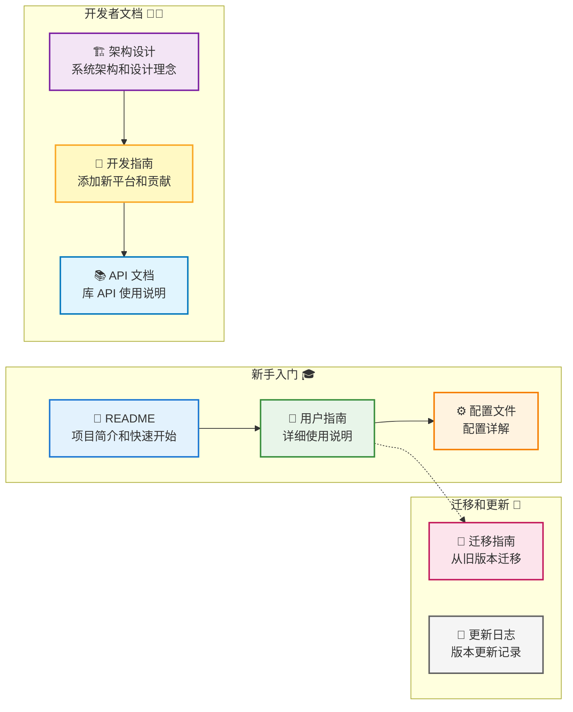

# RVD Next 文档中心

欢迎来到 RVD Next 文档中心！这里包含了所有你需要的文档和指南。

## 📚 文档导航

### 新手入门

- **[README](../README.md)** - 项目简介和快速开始
- **[用户指南](USER_GUIDE.md)** - 详细的使用说明和示例
- **[配置文件](CONFIGURATION.md)** - 配置文件详解

### 开发者文档

- **[架构设计](ARCHITECTURE.md)** - 系统架构和设计理念
- **[开发指南](DEVELOPMENT.md)** - 如何添加新平台和贡献代码
- **[API 文档](API.md)** - 库 API 使用说明

### 迁移和更新

- **[迁移指南](MIGRATION.md)** - 从旧版本迁移到 RVD Next
- **[更新日志](../CHANGELOG.md)** - 版本更新记录

## 🎯 快速链接

### 常见任务

| 任务 | 文档链接 |
|------|---------|
| 安装和配置 | [README - 安装](../README.md#-安装) |
| 下载单个视频 | [用户指南 - 基础使用](USER_GUIDE.md#基础使用) |
| 批量下载 | [用户指南 - 批量下载](USER_GUIDE.md#批量下载) |
| 登录认证 | [用户指南 - 认证登录](USER_GUIDE.md#认证登录) |
| 配置文件 | [配置文件文档](CONFIGURATION.md) |
| 添加新平台 | [开发指南 - 添加新平台](DEVELOPMENT.md#添加新平台) |
| 作为库使用 | [API 文档](API.md) |

### 常见问题

| 问题 | 解决方案 |
|------|---------|
| 下载速度慢 | [用户指南 - 常见问题](USER_GUIDE.md#q-下载速度很慢怎么办) |
| 需要登录 | [用户指南 - 认证登录](USER_GUIDE.md#认证登录) |
| 配置不生效 | [配置文件 - 故障排除](CONFIGURATION.md#故障排除) |
| 从旧版本迁移 | [迁移指南](MIGRATION.md) |

## 📖 文档概览

### [用户指南](USER_GUIDE.md)

面向最终用户的完整使用指南，包括：

- ✅ 基础使用方法
- ✅ 认证和登录
- ✅ 下载选项详解
- ✅ 批量下载技巧
- ✅ 高级功能使用
- ✅ 配置文件说明
- ✅ 常见问题解答
- ✅ 使用技巧

**适合人群**: 所有用户

### [配置文件文档](CONFIGURATION.md)

详细的配置文件格式和选项说明，包括：

- ✅ 完整配置示例
- ✅ 所有配置项详解
- ✅ 配置优先级说明
- ✅ 常见配置场景
- ✅ 故障排除

**适合人群**: 需要自定义配置的用户

### [架构设计](ARCHITECTURE.md)

系统架构和设计理念的深入讲解，包括：

- ✅ 设计理念和目标
- ✅ 架构图和模块说明
- ✅ 核心模块详解
- ✅ 数据流分析
- ✅ 扩展性设计
- ✅ 性能优化策略

**适合人群**: 开发者、架构师、想深入了解项目的用户

### [开发指南](DEVELOPMENT.md)

面向贡献者的开发文档，包括：

- ✅ 开发环境设置
- ✅ 项目结构说明
- ✅ 添加新平台的完整步骤
- ✅ 代码规范
- ✅ 测试指南
- ✅ 调试技巧
- ✅ 贡献流程

**适合人群**: 开发者、贡献者

### [API 文档](API.md)

作为库使用时的 API 说明，包括：

- ✅ 快速开始示例
- ✅ 核心 API 说明
- ✅ 平台 API
- ✅ 核心模块 API
- ✅ 工具 API
- ✅ 错误处理
- ✅ 高级用法

**适合人群**: 想在自己项目中使用 RVD Next 的开发者

### [迁移指南](MIGRATION.md)

从旧版本迁移的指南，包括：

- ✅ 主要变化说明
- ✅ 功能对比
- ✅ 命令行参数变化
- ✅ 配置文件迁移
- ✅ 使用场景迁移
- ✅ 性能对比
- ✅ 故障排除

**适合人群**: 旧版本用户

## 🎓 学习路径

```mermaid
graph TD
    subgraph "初学者路径 🌱"
        B1[📖 阅读 README<br/>了解项目] --> B2[📦 安装程序<br/>按照安装指南]
        B2 --> B3[🚀 快速开始<br/>尝试基本功能]
        B3 --> B4[📘 用户指南<br/>学习更多功能]
        B4 --> B5[⚙️ 配置文件<br/>根据需要配置]
    end
    
    subgraph "进阶用户路径 🚀"
        A1[📘 用户指南<br/>高级功能部分] --> A2[⚙️ 配置文件<br/>所有选项]
        A2 --> A3[🏗️ 架构设计<br/>理解内部实现]
        A3 --> A4[📚 API 文档<br/>作为库使用]
    end
    
    subgraph "开发者路径 👨‍💻"
        D1[🏗️ 架构设计<br/>理解系统设计] --> D2[🔧 开发指南<br/>设置开发环境]
        D2 --> D3[➕ 添加新平台<br/>学习扩展方法]
        D3 --> D4[📚 API 文档<br/>了解核心 API]
        D4 --> D5[💻 参考代码<br/>Bilibili 实现]
    end
    
    B5 -.-> A1
    A4 -.-> D1
    
    style B1 fill:#e3f2fd,stroke:#1976d2,stroke-width:2px
    style B2 fill:#e8f5e9,stroke:#388e3c,stroke-width:2px
    style B3 fill:#fff3e0,stroke:#f57c00,stroke-width:2px
    style B4 fill:#f3e5f5,stroke:#7b1fa2,stroke-width:2px
    style B5 fill:#fff9c4,stroke:#f9a825,stroke-width:2px
    
    style A1 fill:#e1f5fe,stroke:#0277bd,stroke-width:2px
    style A2 fill:#f3e5f5,stroke:#7b1fa2,stroke-width:2px
    style A3 fill:#fff3e0,stroke:#f57c00,stroke-width:2px
    style A4 fill:#e8f5e9,stroke:#388e3c,stroke-width:2px
    
    style D1 fill:#fce4ec,stroke:#c2185b,stroke-width:2px
    style D2 fill:#e1bee7,stroke:#8e24aa,stroke-width:2px
    style D3 fill:#c5e1a5,stroke:#558b2f,stroke-width:2px
    style D4 fill:#bbdefb,stroke:#1976d2,stroke-width:2px
    style D5 fill:#ffccbc,stroke:#d84315,stroke-width:2px
```

### 初学者路径

1. 阅读 [README](../README.md) 了解项目
2. 按照 [README - 安装](../README.md#-安装) 安装程序
3. 跟随 [README - 快速开始](../README.md#-快速开始) 尝试基本功能
4. 查看 [用户指南](USER_GUIDE.md) 学习更多功能
5. 根据需要配置 [配置文件](CONFIGURATION.md)

### 进阶用户路径

1. 深入阅读 [用户指南](USER_GUIDE.md) 的高级功能部分
2. 学习 [配置文件](CONFIGURATION.md) 的所有选项
3. 了解 [架构设计](ARCHITECTURE.md) 理解内部实现
4. 查看 [API 文档](API.md) 学习如何作为库使用

### 开发者路径

1. 阅读 [架构设计](ARCHITECTURE.md) 理解系统设计
2. 按照 [开发指南](DEVELOPMENT.md) 设置开发环境
3. 学习 [开发指南 - 添加新平台](DEVELOPMENT.md#添加新平台)
4. 查看 [API 文档](API.md) 了解核心 API
5. 参考现有代码（如 Bilibili 平台实现）

## 🔍 搜索文档

### 按主题搜索

#### 下载相关
- [基础下载](USER_GUIDE.md#基础使用)
- [批量下载](USER_GUIDE.md#批量下载)
- [下载选项](USER_GUIDE.md#下载选项)
- [下载配置](CONFIGURATION.md#下载配置)

#### 认证相关
- [认证登录](USER_GUIDE.md#认证登录)
- [认证配置](CONFIGURATION.md#认证配置)
- [Cookie 认证](USER_GUIDE.md#cookie-登录)

#### 配置相关
- [配置文件](CONFIGURATION.md)
- [配置优先级](CONFIGURATION.md#配置优先级)
- [环境变量](CONFIGURATION.md#环境变量)

#### 开发相关
- [添加新平台](DEVELOPMENT.md#添加新平台)
- [Platform Trait](ARCHITECTURE.md#1-platform-trait-srcplatformtraitrs)
- [代码规范](DEVELOPMENT.md#代码规范)
- [测试](DEVELOPMENT.md#测试)

## 📝 文档贡献

发现文档问题或想改进文档？

1. 在 GitHub 上提交 Issue
2. 直接提交 Pull Request
3. 在 Discussions 中讨论

文档源文件位于 `docs/` 目录，使用 Markdown 格式。

## 🔗 外部资源

### 相关项目

- [BBDown](https://github.com/nilaoda/BBDown) - 哔哩哔哩下载器
- [yt-dlp](https://github.com/yt-dlp/yt-dlp) - YouTube 下载器
- [lux](https://github.com/iawia002/lux) - Go 语言视频下载器

### API 文档

- [bilibili-API-collect](https://github.com/SocialSisterYi/bilibili-API-collect) - 哔哩哔哩 API 文档

### Rust 资源

- [Rust 官方文档](https://doc.rust-lang.org/)
- [Tokio 文档](https://tokio.rs/)
- [Async Book](https://rust-lang.github.io/async-book/)

## 💬 获取帮助

### 文档相关

如果文档中没有找到答案：

1. 搜索 [GitHub Issues](https://github.com/SpenserCai/rust-video-downloader/issues)
2. 在 [GitHub Discussions](https://github.com/SpenserCai/rust-video-downloader/discussions) 提问
3. 提交新的 Issue

### 使用问题

- 查看 [用户指南 - 常见问题](USER_GUIDE.md#常见问题)
- 查看 [配置文件 - 故障排除](CONFIGURATION.md#故障排除)
- 查看 [迁移指南 - 故障排除](MIGRATION.md#故障排除)

### 开发问题

- 查看 [开发指南 - 常见问题](DEVELOPMENT.md#常见问题)
- 查看 [架构设计](ARCHITECTURE.md)
- 在 GitHub Discussions 讨论

## 📅 文档更新

文档会随着项目更新而更新。查看 [CHANGELOG](../CHANGELOG.md) 了解最新变化。

---

**文档版本**: 1.0.0  
**最后更新**: 2024-XX-XX  
**维护者**: RVD Contributors

如果这些文档对你有帮助，请给项目一个 ⭐️！
