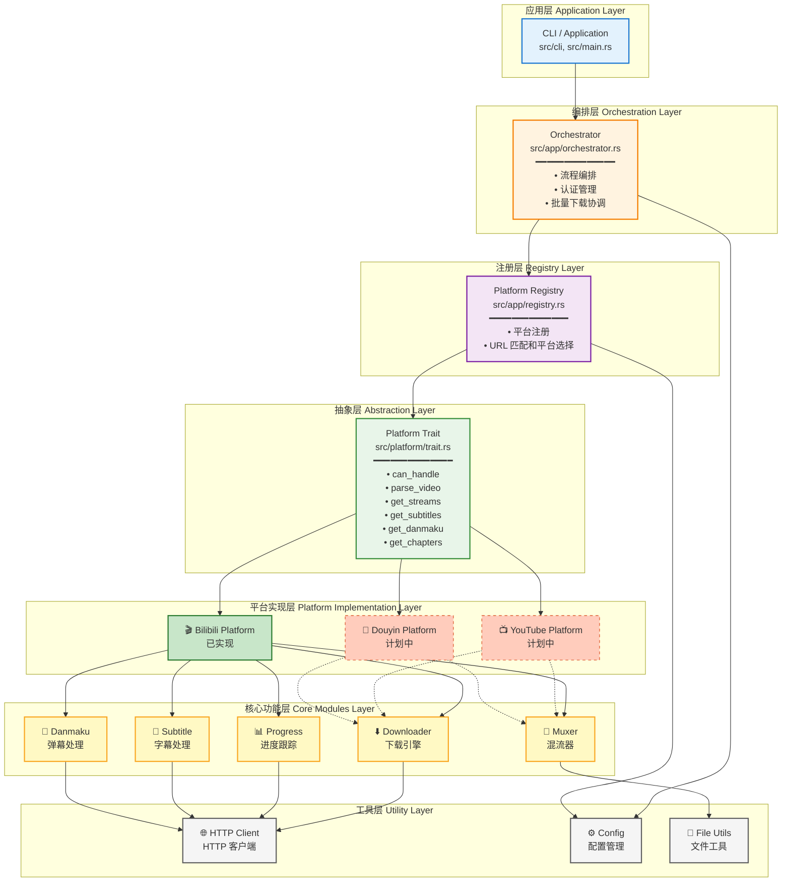
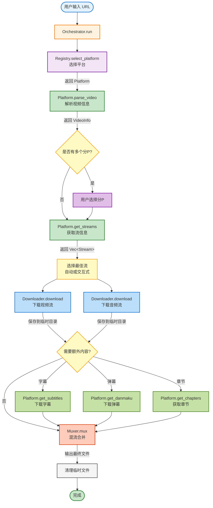
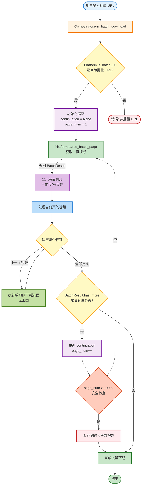

# 架构设计文档

## 概述

RVD Next 采用模块化、可扩展的架构设计，核心目标是支持多个视频平台，同时保持代码的可维护性和可测试性。

## 设计理念

### 1. 平台抽象

通过 `Platform` trait 定义统一的平台接口，所有视频平台都必须实现这个接口。这种设计使得：

- 新增平台无需修改核心代码
- 平台之间完全解耦
- 可以轻松替换或升级单个平台的实现

### 2. 关注点分离

系统分为多个独立的层次，每层负责特定的功能：

- **应用层**: 处理用户交互和流程编排
- **平台层**: 处理平台特定的逻辑
- **核心层**: 提供通用的下载、混流等功能
- **工具层**: 提供 HTTP、配置、文件等基础设施

### 3. 异步优先

全面采用 Tokio 异步运行时，提供高性能的并发处理能力。

## 架构图



## 核心模块详解

### 1. Platform Trait (`src/platform/trait.rs`)

Platform trait 是整个架构的核心，定义了所有平台必须实现的接口。

#### 核心方法

```rust
#[async_trait]
pub trait Platform: Send + Sync {
    // 元数据
    fn metadata(&self) -> &PlatformMetadata;
    
    // URL 处理
    fn can_handle(&self, url: &str) -> bool;
    fn is_batch_url(&self, url: &str) -> bool;
    
    // 视频信息解析
    async fn parse_video(&self, url: &str, auth: Option<&Auth>) -> Result<VideoInfo>;
    async fn parse_batch(&self, url: &str, auth: Option<&Auth>) -> Result<BatchResult>;
    
    // 流获取
    async fn get_streams(&self, context: &StreamContext, auth: Option<&Auth>) -> Result<Vec<Stream>>;
    
    // 可选功能
    async fn get_subtitles(&self, context: &StreamContext) -> Result<Vec<Subtitle>>;
    async fn get_danmaku(&self, context: &StreamContext, format: DanmakuFormat) -> Result<Option<String>>;
    async fn get_chapters(&self, context: &StreamContext) -> Result<Vec<Chapter>>;
    
    // 平台特定优化
    fn optimize_download_url(&self, url: &str) -> String;
    fn customize_download_headers(&self, url: &str) -> Option<HeaderMap>;
}
```

#### 设计要点

1. **异步接口**: 所有 I/O 操作都是异步的
2. **可选功能**: 通过 `supports_feature()` 检查平台能力
3. **平台优化**: 允许平台自定义下载行为（CDN 优化、请求头等）
4. **批量支持**: 内置批量下载和分页支持

### 2. Platform Registry (`src/app/registry.rs`)

平台注册表管理所有已注册的平台，负责根据 URL 选择合适的平台。

```rust
pub struct PlatformRegistry {
    platforms: Vec<Arc<dyn Platform>>,
}

impl PlatformRegistry {
    pub fn register(&mut self, platform: Arc<dyn Platform>);
    pub fn select_platform(&self, url: &str) -> Result<Arc<dyn Platform>>;
}
```

#### 工作流程

1. 应用启动时注册所有平台
2. 用户提供 URL
3. Registry 遍历所有平台，调用 `can_handle()`
4. 返回第一个匹配的平台

### 3. Orchestrator (`src/app/orchestrator.rs`)

编排器协调整个下载流程，是应用层的核心。

#### 主要职责

1. **平台选择**: 通过 Registry 选择平台
2. **认证管理**: 处理多种认证方式（Cookie、Token、QRCode）
3. **流程编排**: 
   - 单视频下载
   - 批量下载（流式分页）
   - 多分P处理
4. **资源管理**: 管理 Downloader、Muxer、ProgressTracker 等资源

#### 批量下载流程

```rust
async fn run_batch_download(&self, url: &str, ...) -> Result<()> {
    let mut continuation: Option<String> = None;
    
    loop {
        // 获取一页视频
        let batch_result = platform.parse_batch_page(url, continuation, auth).await?;
        
        // 立即处理这一页的视频（流式处理）
        for video in batch_result.videos {
            self.process_video(video).await?;
        }
        
        // 检查是否有更多页
        if !batch_result.has_more {
            break;
        }
        continuation = batch_result.continuation;
    }
}
```

**流式处理的优势**:
- 避免一次性加载所有视频到内存
- 可以立即开始下载，无需等待所有视频信息获取完成
- 支持超大收藏夹（10000+ 视频）

### 4. Core Modules (`src/core/`)

核心模块提供平台无关的通用功能。

#### Downloader (`src/core/downloader.rs`)

- 支持多线程分块下载
- 支持 Aria2c 外部下载器
- 自动重试和错误处理
- 进度跟踪

#### Muxer (`src/core/muxer.rs`)

- FFmpeg 混流支持
- MP4Box 混流支持（计划中）
- 字幕嵌入
- 章节信息嵌入
- 杜比视界兼容性检测

#### Progress Tracker (`src/core/progress.rs`)

- 多任务进度跟踪
- 实时速度和 ETA 计算
- 美观的进度条显示

### 5. Platform Implementations

#### Bilibili Platform (`src/platform/bilibili/`)

Bilibili 平台实现展示了如何实现 Platform trait。

**模块结构**:

```
bilibili/
├── mod.rs              # 模块入口和类型定义
├── platform.rs         # Platform trait 实现
├── api.rs              # API 请求封装
├── parser.rs           # URL 解析和信息提取
├── selector.rs         # 流选择逻辑
├── auth.rs             # 认证相关
├── wbi.rs              # WBI 签名
├── app_sign.rs         # APP 签名
├── cdn.rs              # CDN 优化
└── client.rs           # HTTP 客户端封装
```

**关键特性**:

1. **多 API 模式**: Web、TV、APP、International
2. **批量下载**: 收藏夹、UP主空间、合集、系列、番剧
3. **CDN 优化**: PCDN 检测和替换
4. **完整功能**: 字幕、弹幕、章节、封面

## 数据流

### 单视频下载流程



### 批量下载流程



## 扩展性设计

### 添加新平台

添加新平台只需 4 步：

1. **创建平台模块**

```rust
// src/platform/youtube/mod.rs
pub mod platform;
pub use platform::YouTubePlatform;
```

2. **实现 Platform trait**

```rust
// src/platform/youtube/platform.rs
pub struct YouTubePlatform {
    client: Arc<HttpClient>,
    metadata: PlatformMetadata,
}

#[async_trait]
impl Platform for YouTubePlatform {
    fn metadata(&self) -> &PlatformMetadata {
        &self.metadata
    }
    
    fn can_handle(&self, url: &str) -> bool {
        url.contains("youtube.com") || url.contains("youtu.be")
    }
    
    async fn parse_video(&self, url: &str, auth: Option<&Auth>) -> Result<VideoInfo> {
        // 实现 YouTube 视频解析
    }
    
    async fn get_streams(&self, context: &StreamContext, auth: Option<&Auth>) -> Result<Vec<Stream>> {
        // 实现 YouTube 流获取
    }
    
    // ... 实现其他必需方法
}
```

3. **注册平台**

```rust
// src/app/orchestrator.rs
let youtube = Arc::new(crate::platform::youtube::YouTubePlatform::new()?);
registry.register(youtube);
```

4. **添加测试**

```rust
#[tokio::test]
async fn test_youtube_download() {
    let platform = YouTubePlatform::new().unwrap();
    assert!(platform.can_handle("https://www.youtube.com/watch?v=xxx"));
}
```

### 平台特定功能

Platform trait 提供了多个扩展点：

1. **自定义下载行为**

```rust
fn optimize_download_url(&self, url: &str) -> String {
    // 例如：替换 CDN 节点
    url.replace("slow-cdn.com", "fast-cdn.com")
}

fn customize_download_headers(&self, url: &str) -> Option<HeaderMap> {
    // 例如：添加 Referer
    let mut headers = HeaderMap::new();
    headers.insert("Referer", "https://platform.com".parse().unwrap());
    Some(headers)
}
```

2. **平台特定认证**

```rust
fn create_auth_provider(&self, cli: &Cli) -> Result<Box<dyn AuthProvider>> {
    Ok(Box::new(MyPlatformAuthProvider::new(self.client.clone())))
}
```

3. **自定义流选择**

```rust
fn select_best_streams(&self, streams: &[Stream], preferences: &StreamPreferences) -> Result<(Stream, Stream)> {
    // 平台特定的流选择逻辑
}
```

## 性能优化

### 1. 异步并发

- 所有 I/O 操作都是异步的
- 视频和音频可以并行下载
- 批量下载时可以并行处理多个视频

### 2. 流式处理

- 批量下载采用流式分页，避免内存溢出
- 边获取边下载，无需等待所有信息

### 3. CDN 优化

- 平台可以实现 CDN 节点检测和替换
- Bilibili 实现了 PCDN 检测和备用节点切换

### 4. 智能重试

- 下载失败自动重试
- 支持断点续传（Aria2c）

## 错误处理

### 错误类型

```rust
pub enum DownloaderError {
    Parse(String),
    Network(String),
    DownloadFailed(String),
    MuxFailed(String),
    AuthRequired,
    FeatureNotSupported { platform: String, feature: String },
    BatchLimitExceeded { requested: usize, max: usize },
    // ...
}
```

### 错误传播

- 使用 `Result<T>` 类型
- 通过 `?` 操作符传播错误
- 在适当的层次捕获和处理错误

## 测试策略

### 单元测试

- 每个模块都有对应的单元测试
- 使用 `mockito` 模拟 HTTP 请求

### 集成测试

- `tests/` 目录包含集成测试
- 测试完整的下载流程

### E2E 测试

- `e2e_test_platform/` 提供端到端测试框架
- 测试真实的下载场景

## 配置管理

### 配置优先级

```
CLI 参数 > 环境变量 > 配置文件 > 默认值
```

### 配置文件结构

```toml
[http]
user_agent = "custom-ua"
log_user_agent = true

[aria2c]
enabled = true
path = "/usr/bin/aria2c"
args = ["--max-connection-per-server=16"]

[platforms.bilibili]
[platforms.bilibili.cdn]
backup_hosts = ["upos-sz-mirrorcos.bilivideo.com"]

[auth]
cookie = "SESSDATA=xxx"
```

## 未来规划

### 短期目标

1. 完善 MP4Box 混流支持
2. 添加 YouTube 平台支持
3. 添加抖音平台支持

### 长期目标

1. 支持更多视频平台
2. 开发 GUI 界面
3. 实现下载队列管理
4. 支持插件系统

## 总结

RVD Next 的架构设计遵循以下原则：

1. **模块化**: 清晰的模块边界，易于维护
2. **可扩展**: 通过 trait 抽象，易于添加新平台
3. **高性能**: 异步 I/O，并发处理
4. **可测试**: 依赖注入，易于编写测试
5. **用户友好**: 丰富的配置选项，详细的错误信息

这种架构使得 RVD Next 不仅是一个功能强大的下载工具，更是一个可扩展的视频下载框架。
